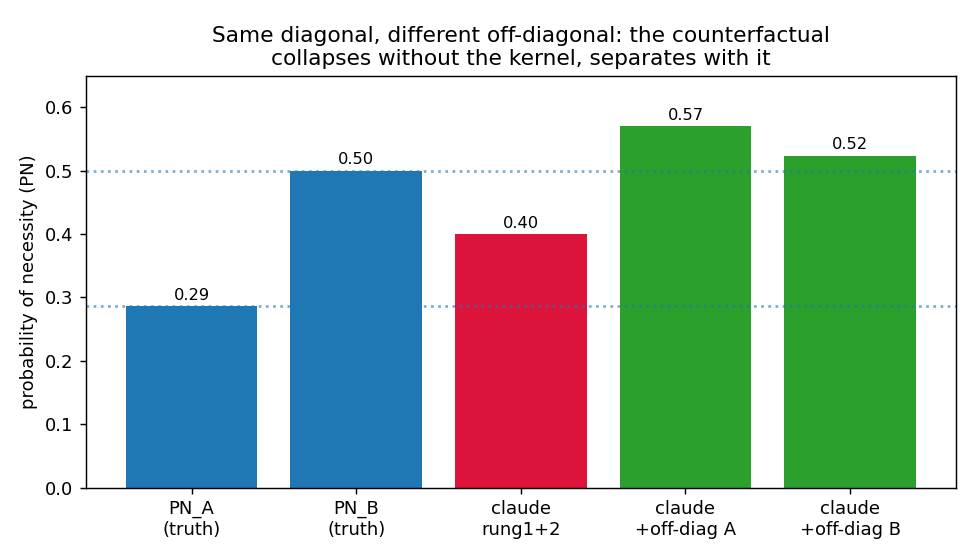
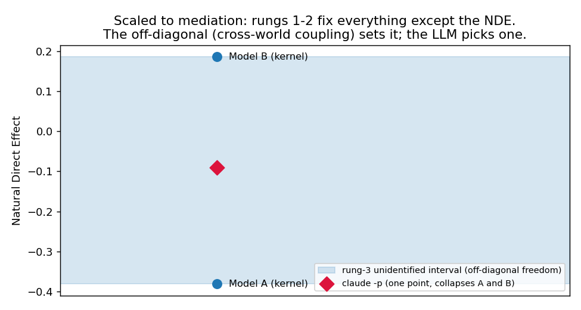
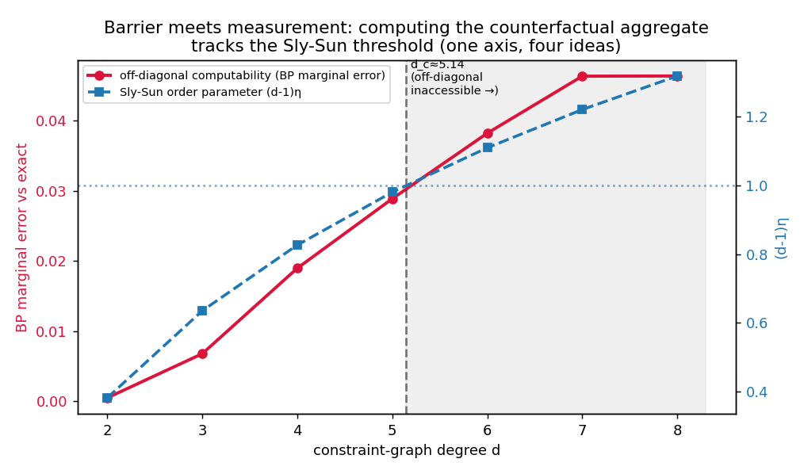
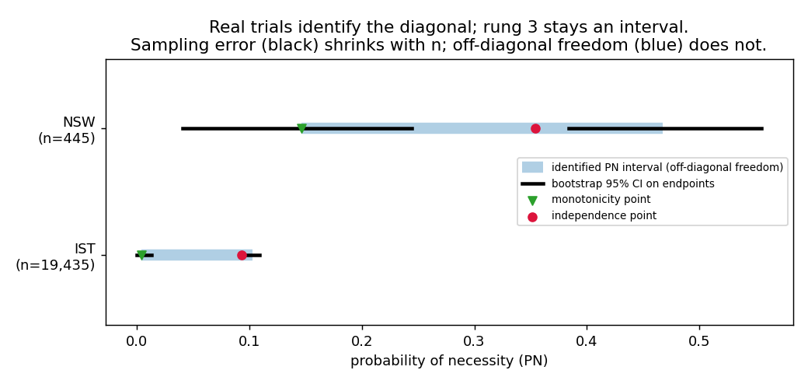
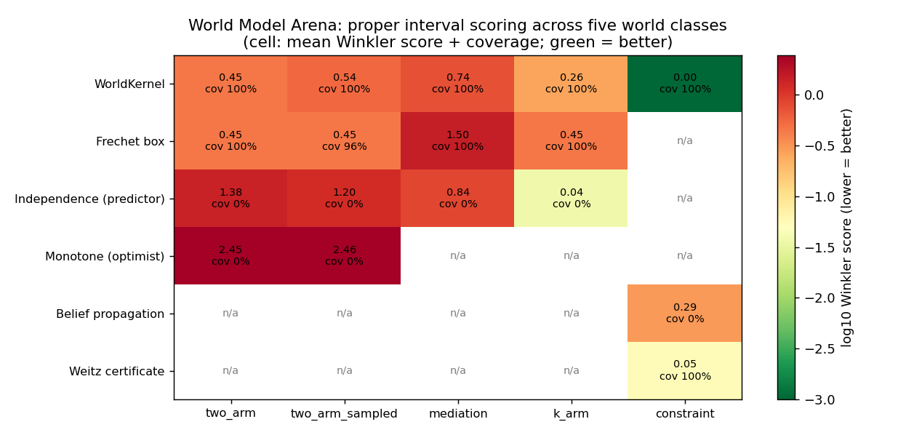
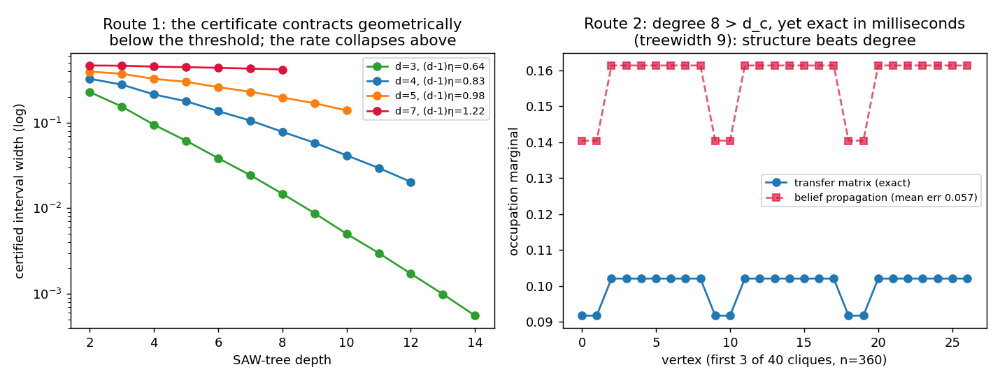
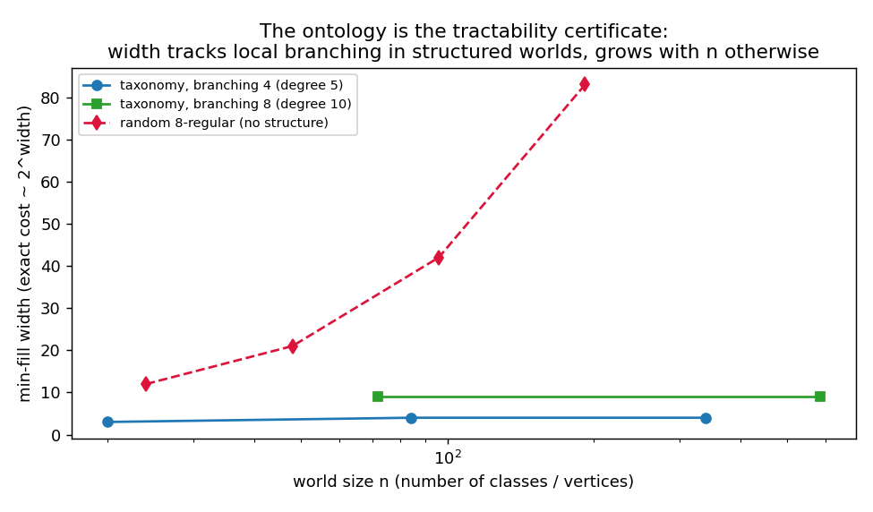

# WorldKernel

**A new kind of world model: not a predictor, a coupling kernel.**

[](https://github.com/fabio-rovai/worldkernel/actions/workflows/ci.yml)
[](LICENSE)
[](pyproject.toml)

This repository builds, in public, the reference implementation of the framework in the paper *WorldKernel: A World Model is the Coupling Kernel of Admissible Possible Worlds* (Fabio Rovai, preprint in preparation).

## The idea in one paragraph

Today's "world models" are predictors: they learn the law of what happens. The claim here is that a world model is a strictly larger object, a positive semidefinite **coupling kernel K(T, T')** over admissible possible worlds. The **diagonal** K(T, T) is everything prediction can ever recover: the observational and interventional marginals of each world (rungs 1 and 2 of Pearl's ladder). The **off-diagonal** K(T, T') is the cross-world coupling between potential outcomes: the quantity every genuine counterfactual reads, and the quantity that no amount of rung-1/2 data, and no predictor however large, identifies. A system that holds only the diagonal must collapse worlds that differ counterfactually. A system that holds the kernel separates them exactly. That gap is not philosophy; it is measurable, and this repo measures it.

## Five verified results (all reproducible here)

**1. The off-diagonal witness.** Two structural causal models with identical observational tables and identical interventional tables (ACE = 0.20), but probability of necessity 0.286 vs 0.500. An LLM (`claude -p`) given the rung-1/2 data returns one number and collapses the worlds; handed the off-diagonal, it separates them. The coupling is the load-bearing sufficient statistic.



**2. Scale: the mediation interval.** Fix *everything* a randomized mediation experiment (X → M → Y) measures and the Natural Direct Effect is still only identified to the interval **[-0.381, +0.187], which spans zero**: the same experimental record is consistent with the direct effect being harmful or helpful. Only the cross-world coupling decides the sign. Computed exactly by LP over the 64-atom response-type polytope; the LLM baseline commits to one point inside the interval and hides the non-identification.



**3. The barrier.** The kernel's PSD structure is real partial-identifying information: a polynomial-time SDP outer bound on cross-world queries, strictly tighter than Fréchet bounds, computable at k = 40 arms where the exact response-type LP has 2^40 variables. And computability has a sharp edge: the aggregate counterfactual under mutual-exclusion constraints tracks the Sly-Sun hard-core threshold at critical degree d_c = 5.141.



**4. Real public trials.** The framework on real data: the Lalonde NSW job-training RCT (n=445), the International Stroke Trial (n=19,435) and Tennessee STAR (3 arms, n=5,789). Each trial identifies the kernel's diagonal; the kernel then computes exactly what rung 3 remains. The IST headline: at 19,435 patients the bootstrap sampling spread on the probability-of-necessity endpoints is 0.013, while the identified interval stays 0.099 wide, a **7.6x gap that no additional data closes**, only an off-diagonal assumption (monotonicity: aspirin never kills a patient who would have survived) does. On STAR's three arms, joint feasibility of one law over all arms tightens the Fréchet lower bound on the cross-world coherence from 0.113 to 0.541: the kernel extracting real information pairwise boxes cannot see.



**5. The witness inside a real world-model platform.** `experiments/swm_witness.py` embeds the off-diagonal witness in [stable-worldmodel](https://github.com/galilai-group/stable-worldmodel)'s TwoRoom environment through its own Gym API: two slip-noise worlds with identical per-action slip marginals (audited on 9,600+ steps per world: max rate gap 0.016 inside the 0.019 sampling band, and exactly equal by construction since the env is otherwise deterministic) but opposite cross-action coupling. The planner-relevant rung-3 query, "this step slipped; would the other action have slipped too?", has measured ground truth **1.000 in one world and 0.298 in the other**. Any world model trained on the platform sees the same data in both and answers with one number; the kernel reports the identified interval and, handed the coupling, scores exact in both worlds.

## The World Model Arena

`worldkernel.arena` is the demonstration at scale: 208 scored queries across **five world classes** (random two-world SCMs, the same under finite samples, mediation laws with free couplings, k-arm coherence, and hard-core constraint worlds spanning random graphs, rings and taxonomies), answered by **six contender strategies** and scored with the **Winkler interval score**, a proper scoring rule under which sharp valid intervals win, loose intervals pay for width, and a point answer pays in full whenever it is wrong. The arena knows each world's full law; contenders only ever see what an experiment would reveal.

Headline results (`experiments/arena.py`, seed 11, locked by tests on an independent seed):

- **The kernel is the only contender that enters all five classes, and holds 100% coverage and 0% overclaim in every one.** Mean rank 1.60 when errors are tolerable (α = 0.2), 1.40 when errors are expensive (α = 0.02), best in both regimes.
- **The standard predictor (independence coupling, mediation plug-in formula, BP) overclaims on 62-95% of queries** depending on class, with 0% coverage; at the safety-critical risk level its score is 10-50x worse than the kernel's.
- **The arena is not rigged.** In the k-arm class the predictor's gamble genuinely pays at loose risk tolerance (0.04 vs 0.26) and stops paying when misses cost 100x their distance (0.36 vs 0.26). The kernel's win is a risk statement, not a fixed fight: *guaranteed coverage dominates exactly when being wrong is expensive*, and the arena measures where that crossover sits.
- **Finite samples break unwidened boxes, not the kernel**: with 500-patient arms, the raw Fréchet box slips to 96% coverage; the kernel's CI-widened intervals hold 100%.



**LLMs as contenders, via AISI Inspect.** [integrations/inspect_arena.py](integrations/inspect_arena.py) packages the arena as an [Inspect AI](https://inspect.aisi.org.uk) task (the UK AI Security Institute's evaluation framework, the one ControlArena is built on), so any LLM can be dropped into the arena and scored with the same Winkler rule, with the kernel's identified interval logged beside every sample. The model is told it may answer with an interval; the eval measures whether an LLM world-model knows what it cannot know.

```bash
pip install inspect-ai
inspect eval integrations/inspect_arena.py --model anthropic/claude-sonnet-4-6
```

Metrics: Winkler at both risk levels, coverage, overclaim rate, and per-question regret against the kernel.

## Trick Room: the thesis as a working planner

[trickroom/](trickroom/) preserves the Trick Room project (inherited from a now-archived private fork of stable-worldmodel): an ontology-specified symbolic substrate (`tbox/tworoom.ttl`, compiled to dynamics, zero training trajectories) plugged into the platform's own CEM-MPC harness, beating a pretrained latent world model **82% vs 48%** on Two-Room planning under audited sequential evaluation, with smaller and more predictable OOD degradation. It is the constructive complement to the witness above: prediction misses the off-diagonal, and what replaces it is writing the world down and compiling it, exactly the ontology-to-width route. Full results, benchmark scripts, engines and the honest evaluation-artefact audit are inside.

## Resolving the hardness barrier, constructively

The Sly-Sun theorem forbids exactly one thing: a general efficient algorithm for the off-diagonal aggregate above the critical degree (that would give NP = RP). The paper treats that as a design constraint, and `worldkernel.tractable` now implements the two routes the theorem leaves open:

**Route 1: certify.** `weitz_interval` runs Weitz's self-avoiding-walk recursion with interval boundary conditions, returning rigorous upper and lower bounds on every off-diagonal marginal, at every depth, on every graph, unconditionally. Below d_c the certificate contracts geometrically and converges to the exact value (verified against enumeration to machine precision); approaching and crossing d_c the contraction rate collapses while cost per depth grows as (d-1)^depth. The barrier stops being a silent failure and becomes a quantity the algorithm reports about its own answer: at comparable compute on n=60 graphs, certified width 0.0006 at d=3 versus 0.42 at d=7.

**Route 2: structure beats degree.** Sly-Sun is a worst-case statement about *degree*; exact computation is governed by *width*. A ring of 40 cliques of size 9 has internal degree 8, far above d_c = 5.141 ((d-1)η = 1.32, squarely in the "hard" regime), yet treewidth 9: `transfer_marginals` computes its hard-core marginals **exactly in 0.02 ms** at n = 360, where enumeration has 2^360 states and belief propagation is measurably wrong (mean error 0.057). Worlds whose constraints come from structured ontologies live in this class by design, which is precisely the kernel's thesis: restriction is the design constraint that keeps the off-diagonal computable.



**Route 2 generalized: the ontology IS the tractability certificate.** `min_fill_order` certifies any constraint graph's width and `treewidth_marginal` computes exact off-diagonal marginals in O(n·2^width), degree-independent. The bridge to knowledge representation: an ontology's disjointness axioms (sibling AllDisjoint cliques plus local property constraints, `disjointness_graph`) generate worlds whose width is set by the *local branching factor, not the number of classes*. Measured: a 1,110-class taxonomy with max degree 13 ((d-1)η = 1.68, far into the hard-by-degree regime) has width 13 and computes exactly in 1.3 s, and the width stays flat as the ontology grows; a random 8-regular world of the same degree has width growing linearly with n (12 → 83) and is dead by n = 96. Writing the ontology is writing the guarantee that your counterfactuals stay computable.



**Three further escape hatches (v0.2.x), each test-locked:**

- **Backdoor collapse** (`worldkernel.backdoor`): the hardness parameter is not degree; it is b(G), the smallest set whose deletion brings the world below the threshold. Conditioning on a backdoor B splits Z and every adaptive restricted marginal into at most 2^|B| residuals, each tractable: fixed-parameter tractable kernel access, computing the *original* quantities, at any global degree. The search for B may be heuristic (minimum deletion is itself hard, as it must be: worst-case Sly-Sun instances need b(G) = Ω(n)); the certificate Δ(G−B) ≤ 5 is checked in linear time. Demonstrated on hub worlds: global degree 9, backdoor of 2, exact Z and marginals matching enumeration to machine precision. Scars, in the paper's language, are deletion-to-uniqueness certificates.
- **Phase quotient** (`worldkernel.phases`): above the threshold the obstruction is phase coexistence, and any bounded query is *affine in the phase weights*. With within-phase values computed (each phase has correlation decay) the only unknown is a low-dimensional weight vector: evidence and ontology constraints carve a convex set, an LP gives a certified interval, a point when the weights are identified. Full kernel reconstruction stays NP-hard; the query-induced quotient is polynomial whenever the phase rank is. Certified rank-2 instance shipped: K(200,200), degree 200, 2·2^200 worlds, exact marginal in microseconds; partial phase evidence yields honest intervals. In the glass regime (exponential phase rank) the correct output is the interval with the unidentified object named: the cross-phase weights.
- **Proof-carrying kernels** (`worldkernel.proofs`): hard to compute is not hard to verify. The hard-core normalizer is a hypercube sum of a low-degree polynomial, exactly the sum-check protocol's home turf: a prover of unlimited effort claims Z; the polynomial-time verifier accepts true claims and rejects false ones with soundness error ~n·Δ/2^61. Implemented and tested: honest proofs accepted, false claims and consistent liars rejected. The kernel entry becomes value + certificate, so an agent can refuse to compute above the barrier and still safely consume supplied off-diagonal values.

- **The elastic wall** (`worldkernel.continuation`): the sharpest reframing. Z is a polynomial with positive coefficients; log Z is analytic off its complex zero set, and zero-freeness converts to deterministic approximation (Barvinok / Patel-Regts). The real-axis Sly-Sun wall is the *shadow of the zero variety*: a polynomial-clearance analytic path to λ = 1 would collapse it (and NP to RP), so hardness is zero-moat / precision hardness, not degree hardness. Implemented and measured: the naive Barvinok disk *always* fails at λ = 1 (the product of root moduli is 1/i_max, so a zero always sits inside |t| < 1, forcing the path framing); truncation converges geometrically inside the moat and breaks beyond it, on real instances; the real segment's clearance is set by the negative-axis Shearer zeros (≥ λ\*(d), narrowing with degree). Honest negative finding, test-locked: the positive-axis pinching near λ_c that asymptotic theory predicts for d ≥ 6 is invisible at enumerable sizes; the wrinkle carrying the hardness lives beyond n = 20.

Together: *below threshold compute, small backdoor condition, low phase rank quotient, otherwise verify proofs or return the certified interval.* The barrier is not beaten; it is factored, and its deepest form is the geometry of complex zeros, not a degree count.

## Use it from any agent: the MCP server

The architecture, made operational: the kernel is the world model, the LLM is a sensor. With the `mcp` extra installed, `worldkernel-mcp` exposes the kernel over the Model Context Protocol, so Claude Code or any MCP client can call it as tools:

```json
{"mcpServers": {"worldkernel": {"command": "worldkernel-mcp"}}}
```

| Tool | What it computes |
| --- | --- |
| `counterfactual_bounds` | Identified PN and fraction-harmed intervals of a two-arm experiment |
| `coupling_query` | Every rung-3 quantity under an explicitly assumed coupling (admissibility-checked) |
| `nde_bounds` | Exact identified NDE interval from a measured mediation record, or infeasibility |
| `coherence_bounds` | Fréchet and exact bounds on cross-world coherence from k-arm marginals |
| `certified_marginal` | Weitz certified interval for any constraint-graph marginal, any degree |
| `exact_marginal_by_width` | Exact marginal by variable elimination, with the width certificate |
| `barrier_diagnostics` | Where a structure sits relative to d_c and what remains computable there |
| `mediation_scaling` | Response-type atom counts (where the counting barrier lives) |

Every tool returns intervals where intervals are the truth, and the server's instructions tell the agent not to pick a point inside one without stating the assumption that picks it. That is the agent loop of [ROADMAP](ROADMAP.md) v0.4: the LLM reads the world and proposes; the kernel computes, certifies, and refuses to overclaim.

## The WorldModel object (v0.2): one front door, every engine

`WorldModel` is the architecture consolidated: register structure, feed data (exact marginals or raw counts), adopt validated assumptions, ask queries. Every answer is a `Verdict` carrying the interval, the engine that produced it, whether it is exact, and the diagnostics that say why. Dispatch is automatic: closed-form sharp bounds, corner-evaluated confidence boxes when data are finite (simultaneous coverage, simulation-tested), the mediation LP, exact variable elimination when the width certificate allows, Weitz certificates when it does not.

```python
from worldkernel import WorldModel

wm = WorldModel()
wm.observe_counts("control", 260, 168).observe_counts("treated", 185, 140)  # NSW
v = wm.pn("control", "treated")
# Verdict([0.0000, 0.6214], engine=corner-evaluated confidence box, exact=False)
v.diagnostics["identified_core"]        # (0.146, 0.468): what more data never shrinks
wm.assume("monotone", "control", "treated")   # validated; inadmissible -> refused
wm.pn("control", "treated")             # collapses to the pinned point

# time: "I took route A and slipped on steps 1, 4, 8; would B have made it?"
cf = wm.trajectory_cf([1,0,0,1,0,0,0,1,0], p=0.3, moves_needed=6)
# exact identified interval; diagnostics carry the predictor's blind point

# decide on intervals, not points
wm.decide({"retry A": (0.55, 0.55), "switch to B": cf}, rule="minimax_regret")
# reports the choice, whether data already determine it, and which
# interval widths are pivotal: the value-of-information map
```

The four layers underneath, each individually tested:

- `worldkernel.estimate`: counts to intervals with a simultaneous coverage guarantee (Wilson + Bonferroni, corner-evaluated; nominal coverage verified by simulation). Sampling inflation and identification core reported separately.
- `worldkernel.dynamics`: sequential potential outcomes. Episode-level counterfactual success bounds, exact over the product of per-step coupling boxes (monotone Poisson-binomial DP), validated against 60,000-episode Monte Carlo. The predictor's independence answer provably ignores the episode's own evidence.
- `worldkernel.propose`: the proposer interface. An LLM proposes assumptions (monotone, independent, bounded correlation, explicit coupling); the kernel validates admissibility, refuses inadmissible ones, and prices what each admissible one buys, with the honest note that rung-1/2 data can never refute an admissible coupling.
- `worldkernel.decide`: act on intervals. Maximin, minimax regret, Hurwicz; interval-dominance check ("is the choice already determined by the data?") and pivotal widths (which assumption or experiment is worth buying).

All of this is exposed over MCP too (`bounds_from_counts`, `evaluate_assumption`, `decide_under_uncertainty`, `trajectory_counterfactual`), completing the agent loop: sensor proposes, kernel calculates, decision layer acts on what is actually known.

## Quickstart

```bash
pip install -e ".[sdp,plots]"
```

```python
from worldkernel import witness_pair, frechet_pn_bounds

A, B = witness_pair()                 # two worlds, same diagonal
A.observational() == B.observational()  # True : same rung 1
A.ace == B.ace                          # True : same rung 2 (0.20)
A.pn(), B.pn()                          # 0.286 vs 0.500 : rung 3 differs
frechet_pn_bounds(0.5, 0.7)             # (0.286, 0.714) : all rung-1/2 can say
```

```python
from worldkernel import nde_interval, random_reference

lo, hi, *_ = nde_interval(random_reference(seed=0))
# (-0.381, 0.187): the NDE of a fully measured experiment, unidentified, spanning zero
```

```python
from worldkernel import frechet_interval, psd_interval, exact_interval
import numpy as np

d = np.random.default_rng(11).uniform(0.15, 0.85, size=8)   # 8-arm trial marginals
frechet_interval(d)   # marginals-only box
psd_interval(d)       # + kernel PSD constraint: tighter, still poly time
exact_interval(d)     # tight set, 2^8 response types (dies past modest k)
```

Reproduce the figures:

```bash
python experiments/counterfactual_witness.py   # add --llm for the claude baseline
python experiments/mediation_interval.py
python experiments/psd_bounds.py
python experiments/barrier_sweep.py
```

## What is in the package

| Module | Object | Role |
| --- | --- | --- |
| `worldkernel.kernel` | `CouplingKernel`, `frechet_interval`, `psd_interval`, `exact_interval` | The kernel as a PSD second-moment matrix and the three nested bounds on cross-world queries |
| `worldkernel.witness` | `TwoWorldKernel`, `witness_pair` | The minimal two-world witness: PN, PS, PNS, and the canonical verified pair |
| `worldkernel.mediation` | `nde_interval`, `rung12_constraints` | The response-type polytope LP for nested cross-world counterfactuals |
| `worldkernel.barrier` | `order_parameter`, `d_critical`, BP and exact hard-core marginals | Where computing the off-diagonal stops being tractable |
| `worldkernel.tractable` | `weitz_interval`, `min_fill_order`, `treewidth_marginal`, `disjointness_graph` | The constructive answer: certified intervals everywhere, exact computation on bounded-width structure, ontology-to-width bridge |
| `worldkernel.mcp_server` | `worldkernel-mcp` | The kernel as an MCP server: agent-facing tools that return intervals, not overclaims |

Every paper number above is locked in by the test suite (`pytest`).

## Why this is a new type of world model

The architecture this implies is the opposite of "scale the predictor": the **kernel is the intelligence and the LLM is a frontier sensor**. The symbolic kernel computes rung 3 exactly, exposes non-identification instead of hiding it, and certifies its own bounds; the LLM proposes structure and reads the world. The verified experiments show why the division of labour matters: even when handed the correct coupling, the LLM baseline misexecutes the arithmetic. Restriction (bounded structure, ontology-shaped couplings) is the design constraint that keeps the kernel computable below the Sly-Sun barrier, not a concession.

## Roadmap

Built in public. The full plan is in [ROADMAP.md](ROADMAP.md); every milestone is an open issue.

- **v0.1 (now):** kernel objects, witnesses, bounds, barrier, tests, CI
- **v0.2:** estimation from data (Balke-Pearl LP as primary baseline, finite-sample diagonals, 2-mediator 4096-atom LP)
- **v0.3:** coupling discovery: can a learner plus an LLM teacher discover the assumption (monotonicity, independence) that pins rung 3?
- **v0.4:** the agent loop: kernel as the world model of an acting agent, LLM as sensor
- **v0.5:** structured kernels at scale: ontology-shaped couplings, SDP relaxations beyond pairwise

## Related work by the author

- CIVeX: counterfactual interval verification for agents ([arXiv:2605.09168](https://arxiv.org/abs/2605.09168))
- Event-Graph Substrates for world models ([arXiv:2605.15967](https://arxiv.org/abs/2605.15967))
- Open Ontologies ([arXiv:2605.09184](https://arxiv.org/abs/2605.09184))
- Saturating Scaling Laws ([arXiv:2605.23983](https://arxiv.org/abs/2605.23983))

## Citing

Paper preprint in preparation. Until it is up:

```bibtex
@software{rovai2026worldkernel,
  author = {Rovai, Fabio},
  title  = {WorldKernel: A World Model is the Coupling Kernel of Admissible Possible Worlds},
  year   = {2026},
  url    = {https://github.com/fabio-rovai/worldkernel}
}
```

## License

MIT
